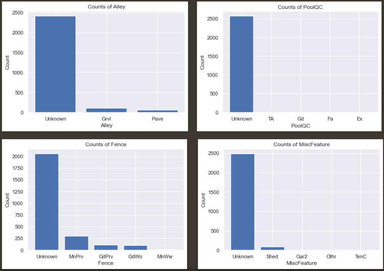

<h2 align="center"> Automate Model Selection in MLOps Pipeline </h2>

<h3 align="center"> Finding Undervalued Homes is the AMES</h3>

<h4 align="center"> Introduction </h4>

Purchasing a home is one of the biggest financial decisions in a person's life. From navigating a dynamic real estate market to understanding property values, the process can often feel overwhelming, particularly when searching for a new home in an unfamiliar area. To alleviate the stress and uncertainty associated with finding an affordable home, many individuals can turn to consultants that specialize in identifying undervalued properties. Secure in the knowledge that their home search is in the capable hands of experts, they can enjoy peace of mind and focus on other important aspects of their lives. 

The key question arises: how can machine learning be leveraged to identify undervalued homes in a specific location, such as Ames, that have the potential to appreciate over time? This data-driven approach aims to provide transparency and a systematic methodology to the home buying process. By utilizing machine learning, we can compare a wide range of machine learning models and evaluate which is the most effective model for predicting sales prices based on key features. Ultimately, the goal is to help clients discover undervalued homes that offer the best bang for their buck, allowing them to purchase properties that are mostly likely  to appreciate in value over time.

<h4 align="center"> Data Preprocessing </h4>

In the data preprocessing phase of the housing dataset, which consists of 2,580 property records and encompasses 79 features from the time period of 2006 to 2010, the following steps were taken:

- For null numerical variables, the original data was scaled using StandardScaler.
- Then missing values were imputed using KNNImputer, which estimates the missing values based on similar records in the dataset. 
- The scaled data was later transformed back to its original scale using inverse_transform. 
- Additionally, for null categorical variables, the missing values were imputed with "Unknown," and all categorical variables were one-hot encoded.

It's important to note that scaling can ensure that predictor variables have the same scale and impact, promoting model stability and reducing variance between features. Rescaling the data can also aid in faster model training. However, if the predictor variables are already on the same scale, scaling is not necessary. I decided to retain the original scale to interpret how a one-unit change in a feature influenced the SalePrice during the exploratory data analysis (EDA) phase.

<h4 align="center"> Exploratory Data Analysis </h4>

During EDA, I generated univariate scatter plots to examine the relationships between the numerical features and SalePrice. To improve clarity, I incorporated linear regression lines into the plots, including the Beta 1 coefficient and Pearson R. Displaying the Pearson R in the univariate scatterplots helped me identify the correlation between the feature and the target variable. 

Based on the findings, certain features showed strong correlations with the sale price, indicated by a high R^2 value or a high beta 1 coefficient. Noteworthy features that stood out were OverallQual, FullBath, TotalBSMTSF, 1stFlrSF, Fireplaces, YearBuilt, GrLivArea, YearRemodAdd, GarageArea, and BsmtFullBath. It is important to note that while some beta coefficients may appear low, their impact on SalePrice is significant because they are being multiplied by a range of high units like square footage or year. This provided clues as to what were the key factors that influence the sale price of a house. 

Additionally, I utilized a heatmap to highlight features that exhibited significant correlations with SalePrice. I also used variation inflation factor (VIF) to drop some features that exhibited multicollinearity. Finally, I made the decision to eliminate features with many null values (e.g., Alley, PoolQC, Fence, MiscFeatures) or features that displayed unclear patterns (e.g., BedroomAbvGr, YrSold).

<h4 align="center"> Feature Selection </h4>

In the interest of time to address the challenge of the dataset's dimensionality, I relied on feature selection techniques to systematically identify the key features for predicting home prices. Initially, I applied Recursive Feature Elimination (RFE), which required a full day to execute and revealed that only 10 features were relevant. This finding influenced my decision to opt for forward feature selection because it was less computationally expensive and improved overall efficiency. I decided don’t focus on what you want to eliminate, focus more on what you want to keep.

To select features, forward stepwise selection was used for linear models, feature importance for tree-based models, and SelectFromModel for Support Vector Regression (SVR) and Multilayer Perceptron (MLP) models. These diverse feature selection techniques were chosen based on their computational efficiency and compatibility with each specific model.

<h4 align="center"> Hyperparameter Tuning & Model Comparison </h4>

By utilizing forward feature selection, I noticed an improvement in the model's predictive performance as specific features unique to each model were added. Among the top 5 models, namely XGBoost, Stacked Ensemble, LightGBM, Decision Tree, and Random Forest, all were tree-based models, outperforming linear models and deep learning. The hyperparameters of these top 5 models were fine-tuned using either GridsearchCV or RandomSearchCV.

Tree-based models excel at capturing interactions and non-linearities within the data. Their ability to recursively split the data into smaller subgroups based on the most important variables allows them to effectively capture complex patterns. On the other hand, linear models struggle to capture these non-linearities and interactions, leading to limitations in their performance.

<h4 align="center"> Automate Model Selection in MLOps Pipeline with Key Features </h4>

Utilizing tree-based models, including the stacked ensemble, in the process of forward feature selection, the following features were selected across the top 5 models (Decision Tree, Random Forest, LightGBM, Stacked Ensemble, and XGBoost):
- Four features (OverallQual, GrLivArea, TotalBsmtSF, and 1stFlrSF) were chosen 3 times.
- Six Features (GarageArea, YearBuilt, YearRemodAdd, BsmtFinSF1, BsmtUnfSF, and Fireplaces) were selected twice.

Based on these specific features, I automated the model selection process for both the 4 best and 10 best features, aiming to minimize the test Mean Absolute Error (MAE). For reference, the MAE measures the average absolute difference between predicted and actual values. The lower the MAE, the better the model's performance, indicating that the predictions are closer to the actual sales price on average.

<h4 align="center"> Winner Model: XGBoost </h4>

After performing a 70/30 train-test split, I implemented a KFold cross-validation strategy with 5 folds, randomly shuffling the records. I then analyzed the R^2 values using boxplots for both the training and test data. XGBoost displayed the highest R^2 value for the test data, showcasing its strong predictive performance and stability. XGBoost also outperformed other models in minimizing the test MAE. Based on these findings, XGBoost emerged as the preferred model and underwent hyperparameter tuning. By analyzing the residuals where the predicted sale price exceeded the actual price, a list of undervalued properties, along with their respective neighborhoods, was generated.

<h4 align="center"> Summary & Actionable Insights </h4>
In summary, the top 5 tree-based models identified several key features that significantly influence the prediction of the target variable (home prices). These features include OverallQual, GrLivArea, TotalBsmtSF, 1stFlrSF, GarageArea, YearBuilt, YearRemodAdd, BsmtFinSF1, BsmtUnfSF, and Fireplaces. To enhance the value of undervalued properties, the proposed strategy is to prioritize investments that focus on expanding living space. Utilize high-quality materials and showcase superior craftsmanship to create an elegant appearance. This combination will attract potential buyers and ensure long-term desirability. It is also a good idea to visit undervalued properties and collaborate with real estate agents and appraisers to gain insights into external factors that the model may not capture. Such factors can include the proximity of houses to amenities such as public transportation, schools, parks, cafes, and shops, which can contribute to potential price appreciation.

<h4 align="center"> Further Approaches to Enhance Project </h4>
Here are additional approaches that can enhance the project even further. For instance, experimenting with more computationally intensive methods like backward stepwise selection during feature selection may uncover features that perform well across multiple models. Additionally, performing feature engineering, such as binning the YearBuilt variable, could improve the performance of linear models. It is also important to address outliers, as they can potentially impact housing pricing predictions, and develop strategies to handle them effectively. Finally, to validate the predictions of an updated model, compare its outputs with the actual prices listed on live platforms like Redfin using recent data and key features.

<h4 align="center"> Conclusion </h4>

In conclusion, incorporating machine learning techniques into the homebuying process can enhance decision-making and offer valuable insights for buyers. While these methods can provide useful guidance, it's important to remember that no model or prediction can be solely relied upon in a dynamic real estate market. Instead, buyers should adopt a comprehensive approach that combines machine learning with traditional research, expert guidance, and personal preferences. This holistic strategy will empower buyers to make informed choices and effectively navigate the intricacies involved in purchasing a home.
 
